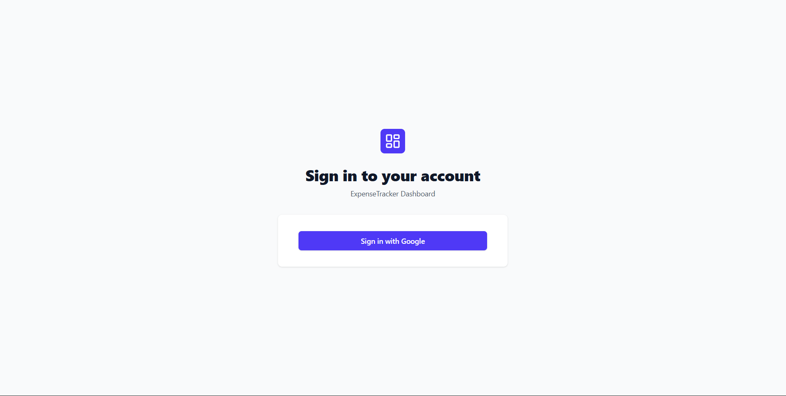
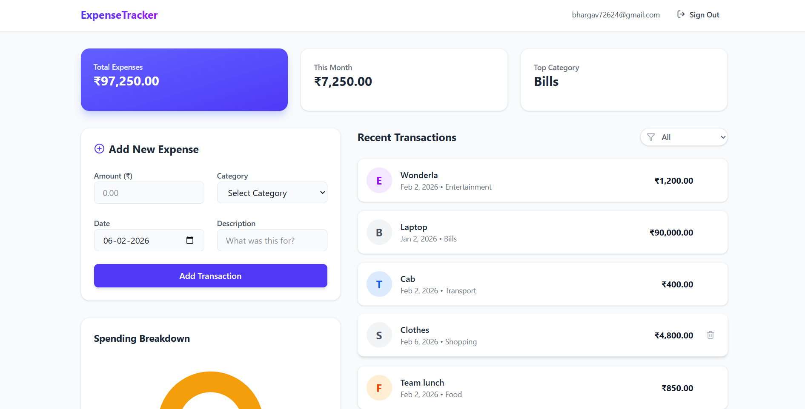

# 💸 Personal Expense Tracker

A modern, responsive web application designed to simplify personal finance management. This dashboard allows users to track expenses in real-time, visualize spending habits, and maintain control over their financial data through a secure, cloud-based infrastructure.

[Live Demo](https://penthara.netlify.app/)

---

## 📖 Table of Contents

- [Project Overview](#-project-overview)
- [Key Features](#-key-features)
- [Architecture & Tech Stack](#-architecture--tech-stack)
- [Application Previews](#-application-previews)
- [Getting Started](#-getting-started)
- [Project Structure](#-project-structure)
- [Future Improvements](#-future-improvements)
- [Author](#-author)

---

## 🧐 Project Overview

Managing finances shouldn't be a chore. This project was built to solve the problem of fragmented financial tracking. By leveraging the speed of Vite and the reliability of Firebase, this application offers a seamless experience for users to log, view, and analyze their daily expenditures.

The goal of this assignment was to demonstrate proficiency in:
* **React** state management
* **Component modularity**
* **BaaS** (Backend as a Service) integration

---

## ✨ Key Features

* **🔐 Secure Authentication:** Robust sign-up and login functionality powered by **Firebase Auth**, ensuring user data remains private and secure.
* **📊 Dynamic Data Visualization:** Interactive pie charts and graphs (via **Recharts**) provide immediate insights into spending distribution across categories.
* **⚡ Real-Time Database:** Utilizes **Firestore** to sync data instantly across devices. Add an expense on your phone, and it appears immediately on your desktop.
* **📱 Fully Responsive:** Specific UI/UX design implemented with **Tailwind CSS** guarantees a smooth interface on mobile, tablet, and desktop screens.
* **🗑 CRUD Functionality:** Complete control to Create, Read, Update, and Delete expense records effortlessly.

---

## 🛠 Architecture & Tech Stack

This project uses a component-based architecture using the following technologies:

### Frontend
* **React (v18):** Core UI library for building the component tree.
* **Vite:** Next-generation frontend tooling for ultra-fast build times.
* **Tailwind CSS:** Utility-first CSS framework for rapid, responsive styling.
* **Lucide React:** Lightweight, scalable icon library.
* **Recharts:** Composable charting library for React components.

### Backend & Services
* **Firebase Authentication:** Identity management.
* **Cloud Firestore:** NoSQL cloud database for storing expense documents.

---

## 📸 Application Previews

| Dashboard View | Add Expense Modal |
|:---:|:---:|
|  |  |

*(Note: Please ensure you upload screenshots to an `assets` folder in your repo or update the links above)*

---

## 🚀 Getting Started

Follow these instructions to set up the project locally on your machine.

### Prerequisites
* Node.js (v16 or higher)
* npm or yarn

### Installation Steps

1.  **Clone the Repository**
    ```bash
    git clone [https://github.com/your-username/expense-tracker.git](https://github.com/your-username/expense-tracker.git)
    cd expense-tracker
    ```

2.  **Install Dependencies**
    ```bash
    npm install
    ```

3.  **⚠️ Configure Environment Variables**
    Create a file named `.env` in the root directory. Add your Firebase configuration keys (these are required for the database to connect):

    ```env
    VITE_API_KEY=your_api_key
    VITE_AUTH_DOMAIN=your_project_id.firebaseapp.com
    VITE_PROJECT_ID=your_project_id
    VITE_STORAGE_BUCKET=your_project_id.appspot.com
    VITE_MESSAGING_SENDER_ID=your_sender_id
    VITE_APP_ID=your_app_id
    ```

4.  **Run the Development Server**
    ```bash
    npm run dev
    ```

5.  **Open the App**
    Visit `http://localhost:5173` in your browser.

---

## 📂 Project Structure

A quick look at the top-level files and directories you'll see in this project.

```text
.
├── src/
│   ├── components/    # Reusable UI components (Cards, Charts, Modals)
│   ├── contexts/      # Context API for global state (AuthContext)
│   ├── pages/         # Page components (Dashboard, Login, Signup)
│   ├── config/        # Firebase initialization
│   ├── App.jsx        # Main application entry
│   └── main.jsx       # DOM rendering
├── public/            # Static assets
└── index.html         # HTML entry point
